# battleships
**React Native Project** `@fmi-unibuc`

<p>
  <!-- iOS -->
  
  <!-- Android -->
  
  <!-- Web -->
</p>

## 🚀 Getting Started

### Prerequisites
- Node.js >= 14.x
- npm >= 6.x
- Expo CLI (`npm install -g expo-cli`)

### Installation
1. Clone the repository:
   ```bash
   git clone https://github.com/laurentiucretu68/battleships
   cd battleships
   ```
   
2. Install the dependencies:
   ```bash
   npm install
    ```

3. Start the project:
    ```bash
    npm start
    ```

## 📱 Features
* User Authentication (Login, Register)
* Main Menu Navigation
* Play and Manage Games
* Search and Join Existing Games
* Create New Games

## 🔄 Flow Visualization

## 📝 Screenshots

### Login and Register
<p float="left">
  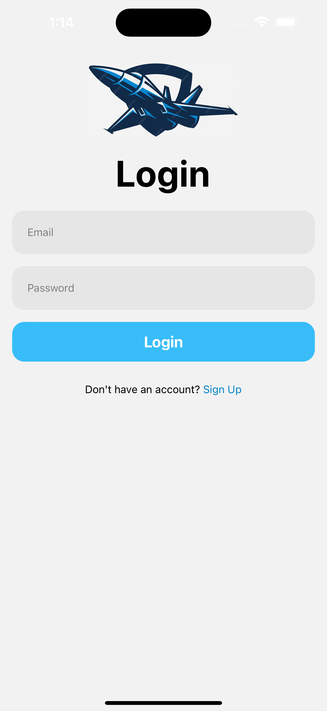
  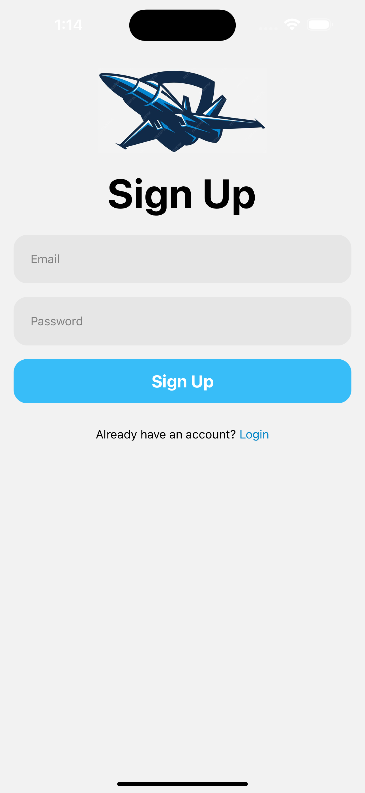
</p>

### Home and Menu
<p float="left">
  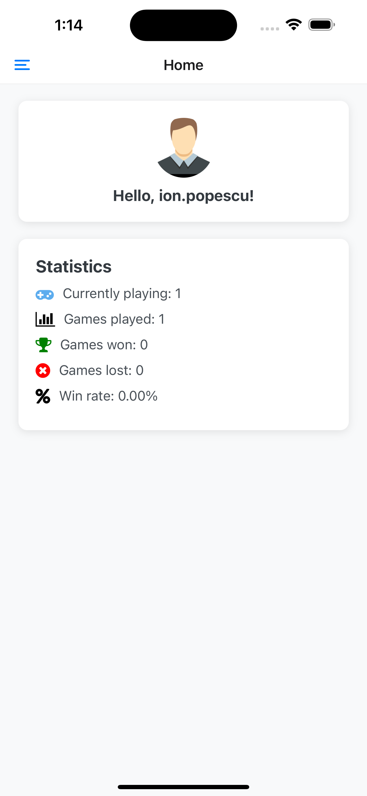
  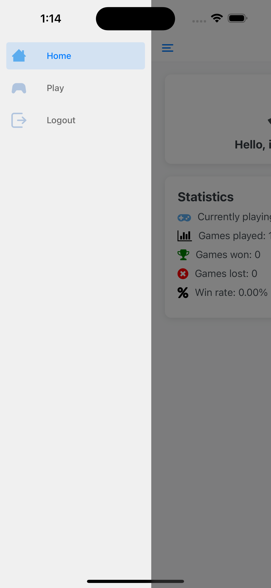
</p>

### Available Games and Search Game
<p float="left">
  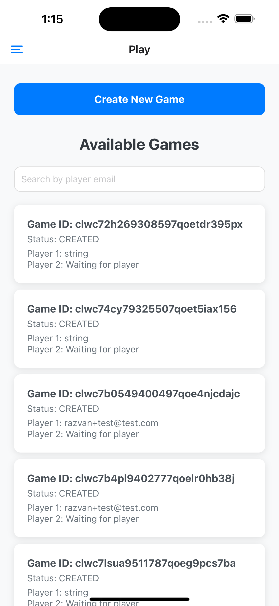
  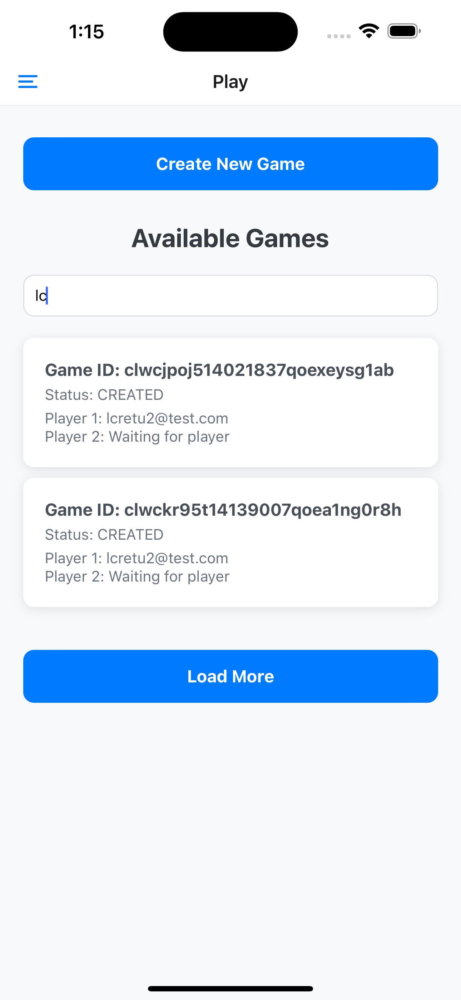
</p>

### Create Game and Join Game
<p float="left">
  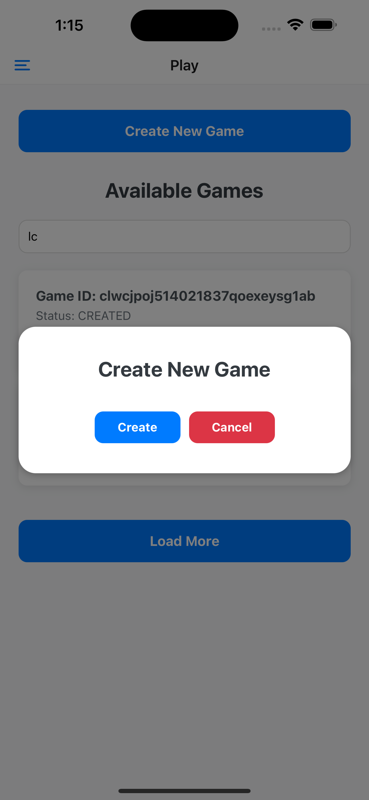
  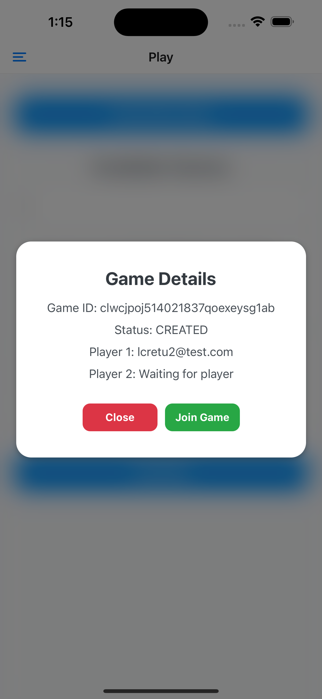
</p>

### Game Board
<p float="left">
  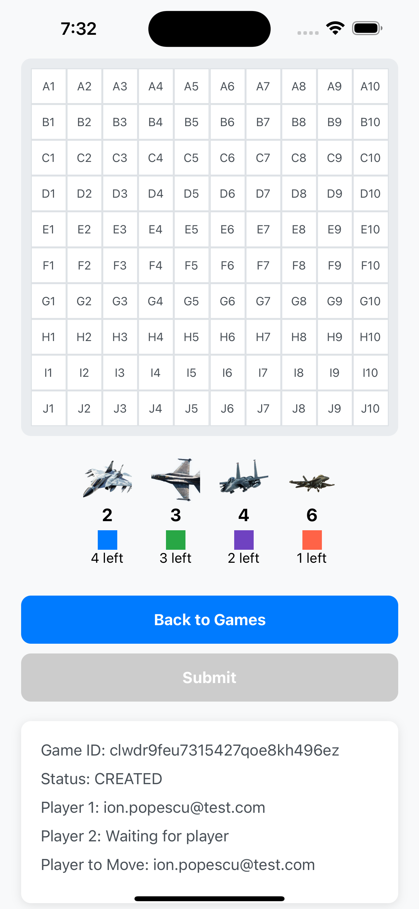
  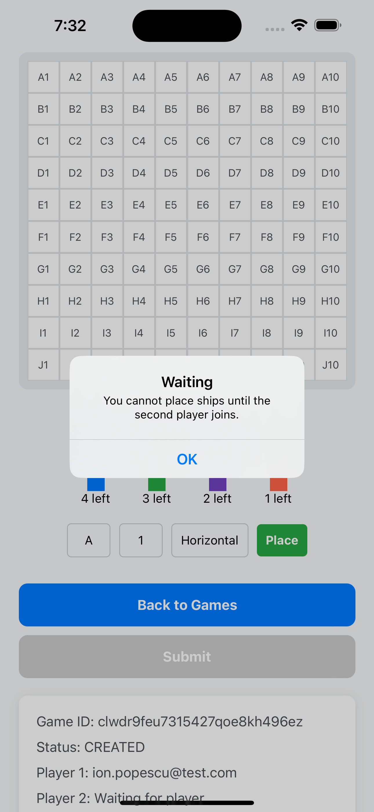
</p>
<p float="left">
  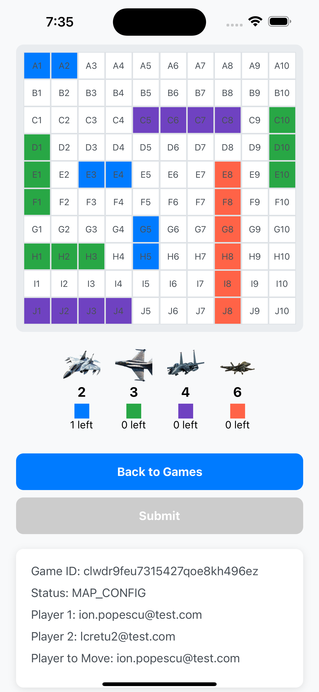
  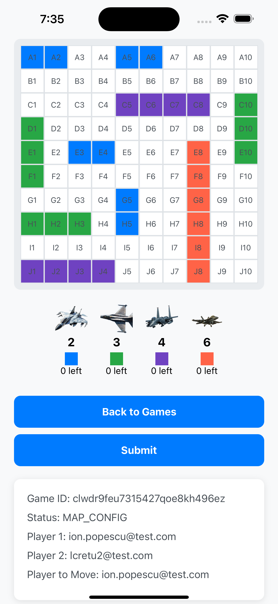
</p>
<p float="left">
  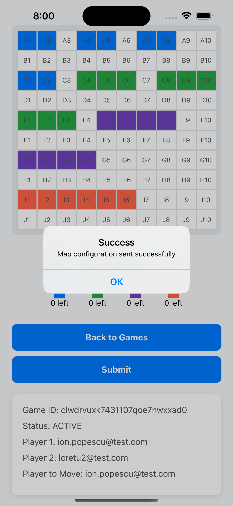
</p>

## 📄 License
This project is licensed under the MIT License - see the <a href="https://github.com/git/git-scm.com/blob/main/MIT-LICENSE.txt">LICENSE</a> file for details.

## 💬 Contact
If you have any questions or need further assistance, feel free to contact us at <a href="mailto:lcretu@bitdefender.com">lcretu@bitdefender.com</a>